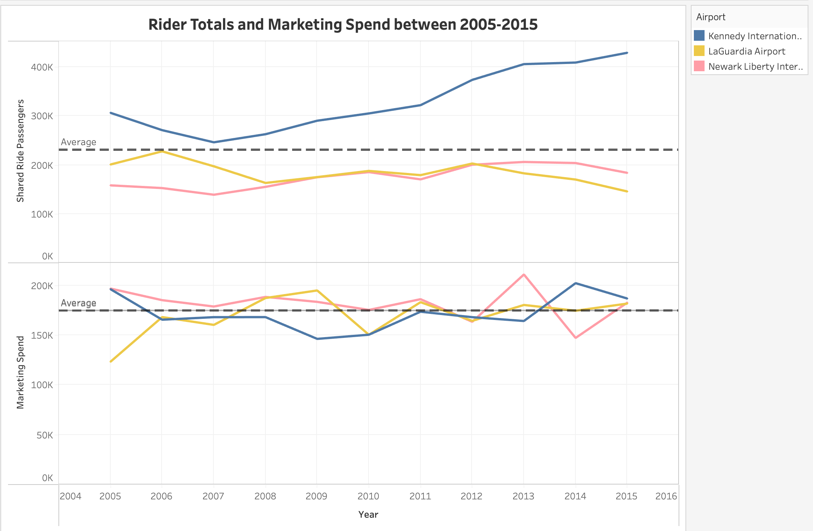

# Tableau

## Business Question: Uber wants to know where to focus their efforts for maxiumum return on ad spend. 

Here, in Tableau, I've produced a chart displaying amount of Uber riders and Uber company ad spend for uber between three airport regions over time. I conclude that Kennedy International Airport has had more riders than Newark and Laguardia the entire decade and has been trending up since 2007. Most recently in 2015, it was at 160% more riders than the others. Our ad spend has been relatively similar between the three airports, with Kennedy’s ad spend being less than the average for most of the decade. Kennedy produces 2.3 riders per ad dollar spent, whereas Newark and Laguardia perform much worse at less than 1 rider per ad dollar.

